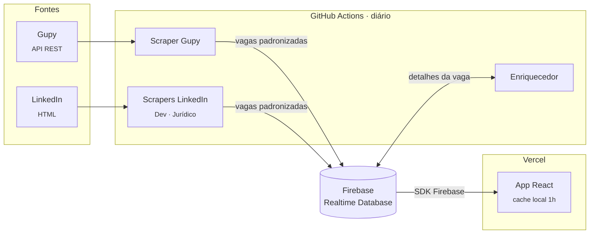

<div align="center">

<a href="https://my-orbita.vercel.app/">
  
</a>

<h3>Agregador de vagas que reúne Gupy e LinkedIn em um único lugar</h3>

<p>Filtros por modalidade, estado, nível, contrato e origem, com coleta automática todos os dias.</p>

<p>
  <a href="https://my-orbita.vercel.app/"></a>
</p>

<p>
  <a href="https://github.com/MaiconVts/MyOrbita/actions/workflows/gupy.yml"></a>
  <a href="https://github.com/MaiconVts/MyOrbita/actions/workflows/linkedin-dev.yml"></a>
  <a href="https://github.com/MaiconVts/MyOrbita/actions/workflows/linkedin-adv.yml"></a>
  <a href="https://github.com/MaiconVts/MyOrbita/actions/workflows/linkedin_enricher.yml"></a>
</p>

<p>
  
  
  
  
  
  
</p>

<p>
  
  
  
</p>

<sub>Projeto solo de portfólio técnico · <a href="#o-que-é">O que é</a> · <a href="#arquitetura">Arquitetura</a> · <a href="#agenda-de-coleta">Agenda</a> · <a href="#como-rodar-localmente">Rodar localmente</a> · <a href="#documentação">Docs</a></sub>

</div>

---

## O que é

MyOrbita resolve um problema simples: buscar vagas exige acessar múltiplas plataformas manualmente, cada uma com sua própria interface e limitações. O sistema coleta vagas automaticamente todos os dias, padroniza os dados e os serve em uma interface unificada com filtros que as próprias plataformas não oferecem de forma consolidada.

<table>
  <tr>
    <td width="50%" valign="top">
      <h3>💻 Tecnologia</h3>
      Vagas de desenvolvimento do <b>Gupy</b> e do <b>LinkedIn</b>, em <a href="https://my-orbita.vercel.app/vagas-dev"><code>/vagas-dev</code></a>.
    </td>
    <td width="50%" valign="top">
      <h3>⚖️ Direito</h3>
      Vagas jurídicas do <b>Gupy</b> e do <b>LinkedIn</b>, em <a href="https://my-orbita.vercel.app/vagas-adv"><code>/vagas-adv</code></a>.
    </td>
  </tr>
</table>

| | Recurso |
|:---:|---|
| 🔎 | Busca por título, empresa ou localização |
| 🧭 | Filtros por modalidade, nível, estado, tipo de contrato, PCD e plataforma de origem |
| ♻️ | Deduplicação por ID determinístico gerado a partir da URL |
| ⚡ | Cache local de 1h no navegador; filtros aplicados sem novas chamadas ao banco |

---

## Stack

| Camada | Tecnologia |
|---|---|
| Coleta |  `curl_cffi` · `lxml` · `requests` |
| Banco de dados |  |
| Automação |  |
| Frontend |     |
| Deploy |  |

---

## Arquitetura

O sistema roda inteiramente em background via GitHub Actions. Quatro workflows independentes executam diariamente em horários escalonados — scrapers de listagem, enriquecedor de dados e persistência no Firebase. O frontend consome os dados via SDK do Firebase com cache local de 1h.



Construído com Clean Architecture, SOLID e Design Patterns. A estrutura permite adicionar novas fontes de vagas com alterações mínimas — um novo scraper, um novo entry point, um novo workflow.

O scraper do LinkedIn usa técnicas de anti-detecção (TLS fingerprinting, delays gaussianos, circuit breaker), descritas em [`docs/05_ANTI_DETECCAO.md`](./docs/05_ANTI_DETECCAO.md).

### Agenda de coleta

| Workflow | Horário (BRT) | Cron (UTC) |
|---|:---:|:---:|
| Scraper Gupy | **03h42** | `42 6 * * *` |
| Scraper LinkedIn Dev | **04h45** | `45 7 * * *` |
| Scraper LinkedIn Jurídico | **12h00** | `0 15 * * *` |
| Enriquecedor LinkedIn | **16h00** | `0 19 * * *` |

---

## Como rodar localmente

**Pré-requisitos:**  

```bash
# Backend
pip install -r requirements.txt
# Configurar secrets/firebase_key.json e .env
python main_gupy.py
python main_linkedin_dev.py

# Frontend
cd myorbita-web
npm install
npm run dev
```

Instruções completas de configuração em [`docs/04_CI_CD.md`](./docs/04_CI_CD.md).

---

## Documentação

Documentação técnica completa em [`/docs`](./docs).

<details>
<summary><b>Ver índice dos documentos</b></summary>
<br>

| Documento | Assunto |
|---|---|
| [`01_CONTEXTO_PROJETO.md`](./docs/01_CONTEXTO_PROJETO.md) | Contexto e objetivos do projeto |
| [`02_ARQUITETURA.md`](./docs/02_ARQUITETURA.md) | Arquitetura e organização do código |
| [`03_DADOS.md`](./docs/03_DADOS.md) | Modelo de dados |
| [`04_CI_CD.md`](./docs/04_CI_CD.md) | CI/CD e configuração do ambiente |
| [`05_ANTI_DETECCAO.md`](./docs/05_ANTI_DETECCAO.md) | Estratégias de anti-detecção |
| [`06_PLANO_TESTES.md`](./docs/06_PLANO_TESTES.md) | Plano de testes |
| [`07_CLAUDE.md`](./docs/07_CLAUDE.md) | Instruções para desenvolvimento assistido por IA |

</details>

---

## Sobre o uso de Inteligência Artificial

Este projeto foi desenvolvido com o auxílio do Claude (Anthropic) como ferramenta de desenvolvimento — e isso foi uma decisão deliberada, não uma limitação.

Com mais de 15 mil linhas de código, quatro scrapers, um sistema de enriquecimento assíncrono, pipeline de CI/CD completo e interface web com filtros avançados, manter tudo isso sozinho em cerca de quatro meses seria inviável sem o uso inteligente de ferramentas. A IA foi parte da estratégia desde o início.

> **O que a IA fez:** acelerou decisões de arquitetura, ajudou a implementar features complexas, depurou problemas difíceis de rastrear e colaborou na escrita de automações de CI/CD.

> **O que eu fiz:** cada decisão técnica e arquitetural foi tomada por mim. Defini o escopo, escolhi o stack, estruturei a arquitetura, validei cada solução proposta, identifiquei os problemas, dirigi o desenvolvimento e mantive a visão do produto do início ao fim. A IA não tomou uma decisão sequer sem que eu entendesse o que estava sendo feito e por quê.

Saber usar IA para desenvolver é uma habilidade real. Não se trata de delegar — trata-se de saber o que pedir, como avaliar o que recebe, e quando discordar. Ao longo do projeto, discordei, corrigi e refiz diversas vezes. O projeto é meu. A IA foi uma ferramenta, como um compilador ou um linter.

O resultado foi um projeto que vai além do que entregaria sozinho no mesmo tempo — e isso é exatamente o ponto.

---

## Licença

© 2026 Maicon Vitor. Todos os direitos reservados. Uso comercial proibido sem autorização expressa do autor.

<div align="center">
<br>
<a href="https://my-orbita.vercel.app/"></a>
<a href="https://github.com/MaiconVts"></a>
</div>
